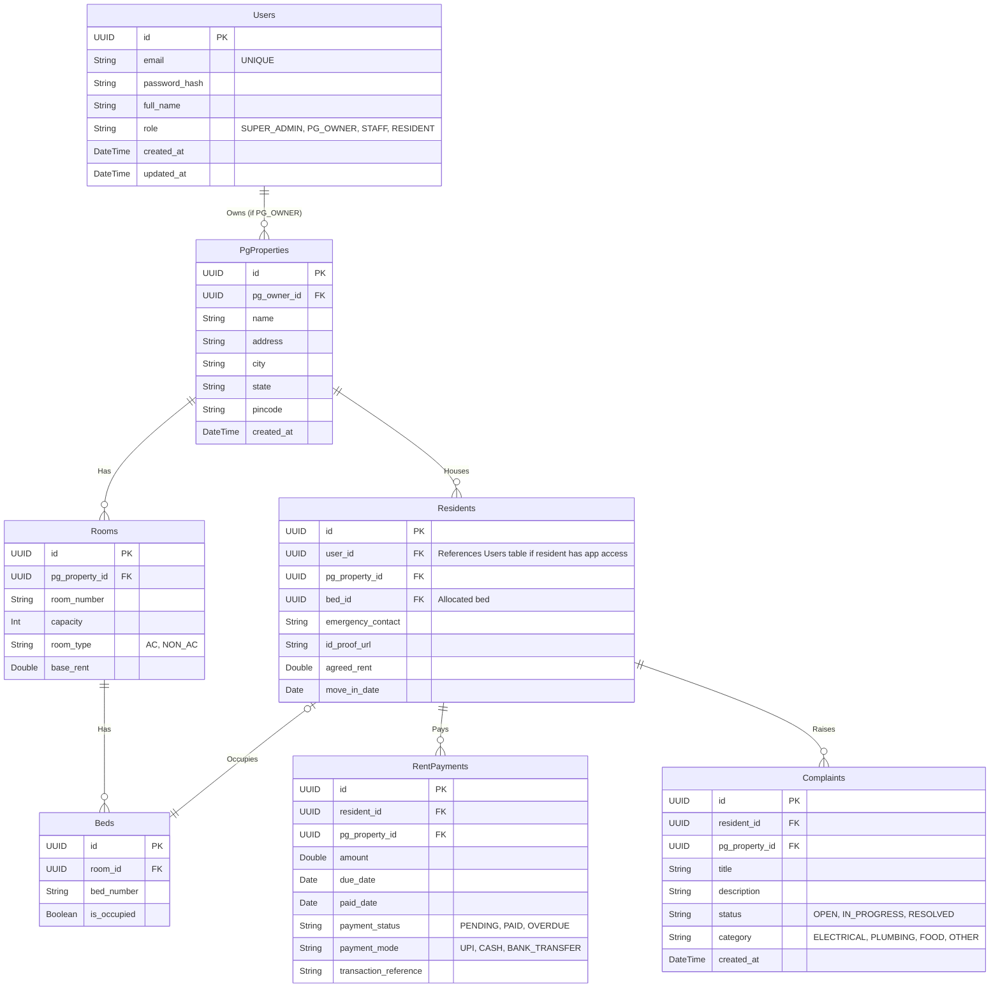

# PG Connect - Database Design & ER Diagram

## Multi-Tenancy Strategy
We are using a **Shared Database, Shared Schema** architecture. Every table that belongs to a specific PG Owner will have a `pg_owner_id` column to isolate data. This approach is highly scalable and cost-effective for a SaaS platform starting out.

## Entities and Relationships

## Explanation
*   **Users:** Stores all user accounts (Admin, Owners, Staff, Residents) for authentication.
*   **PgProperties:** Represents the physical PG buildings. An owner can have multiple.
*   **Rooms & Beds:** Hierarchical mapping of physical space inside a PG.
*   **Residents:** Stores resident-specific information, linking a User to a Bed in a specific PG.
*   **RentPayments:** Tracks the billing cycle for residents.
*   **Complaints:** Ticketing system for maintenance/issues.
